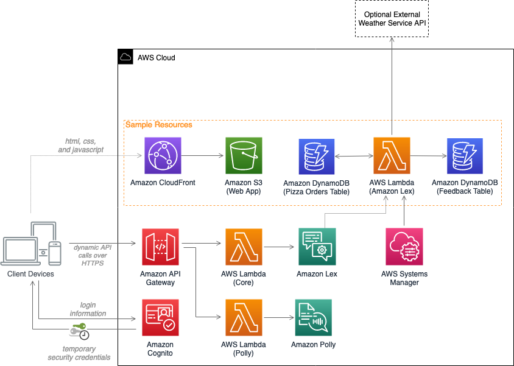

# Serverless Bot Framework
The Serverless Bot Framework is a collection of AWS services combined into a single solution that any company can use to have a scalable and high-available multi-language audiobot, chatbot and touch interface with their customers.


## On this Page
- [Architecture Overview](#architecture-overview)
- [Deployment](#deployment)
- [Source Code](#source-code)
- [Creating a custom build](#additional-resources)


## Architecture Overview


## Deployment
The solution is deployed using a CloudFormation template with a lambda backed custom resource. For details on deploying the solution please see the details on the solution home page: [Serverless Bot Framework](https://aws.amazon.com/solutions/serverless-bot-framework/)

## Source Code

**source/modules**
Contains a nodejs module named b2.core that is used in train-model lambda function and polly-service lambda function.

**source/samples**
Includes four components, two sample lambda functions, a custom resource and a front-end web client. This code can be extended to add different functionalities to the bot.

**source/services**
Includes source code for three lambda functions, core, custom-resource, and polly-service.

**source/services/custom-resource**
A Python Lambda function used as a CloudFormation custom resource for configuring Amazon S3 bucket notifications and to send anonymous metrics.


## Creating a custom build
The solution can be deployed through the CloudFormation template available on the solution home page: [Serverless Bot Framework](https://aws.amazon.com/solutions/implementations/serverless-bot-framework/).
To make changes to the solution, download or clone this repo, update the source code and then run the deployment/build-s3-dist.sh script to deploy the updated Lambda code to an Amazon S3 bucket in your account.

### Prerequisites:
* [AWS Command Line Interface](https://aws.amazon.com/cli/)
* Node.js 10.x or later
* (Optional) [AccuWeather](https://developer.accuweather.com/) or [OpenWeather](https://openweathermap.org/api) API keys

### 1. Create an Amazon S3 Bucket
The CloudFormation template is configured to pull the Lambda deployment packages from Amazon S3 bucket in the region the template is being launched in. Create a bucket in the desired region with the region name appended to the name of the bucket. eg: for us-east-1 create a bucket named: ```my-bucket-us-east-1```
```
aws s3 mb s3://my-bucket-us-east-1
```

### 2. Create the deployment packages
Build the distributable:
```
chmod +x ./build-s3-dist.sh
./build-s3-dist.sh my-bucket serverless-bot-framework %%VERSION%%-custom
```

> **Notes**: The _build-s3-dist_ script expects the bucket name as one of its parameters, and this value should not include the region suffix. In addition to that, the version parameter will be used to tag the npm packages, and therefore should be in the [Semantic Versioning format](https://semver.org/spec/v2.0.0.html).

Deploy the distributable to the Amazon S3 bucket in your account:
```
aws s3 cp ./regional-s3-assets/ s3://my-bucket-us-east-1/serverless-bot-framework/%%VERSION%%-custom/ --recursive --acl bucket-owner-full-control
```

### 3. Launch the CloudFormation template.
* Get the link of the serverless-bot-framework.template uploaded to your Amazon S3 bucket.
* Deploy the serverless bot framework to your account by launching a new AWS CloudFormation stack using the link of the serverless-bot-framework.template.

***

Copyright 2019 Amazon.com, Inc. or its affiliates. All Rights Reserved.

Licensed under the Apache License, Version 2.0 (the "License");
you may not use this file except in compliance with the License.
You may obtain a copy of the License at

    http://www.apache.org/licenses/LICENSE-2.0

Unless required by applicable law or agreed to in writing, software
distributed under the License is distributed on an "AS IS" BASIS,
WITHOUT WARRANTIES OR CONDITIONS OF ANY KIND, either express or implied.
See the License for the specific language governing permissions and
limitations under the License.